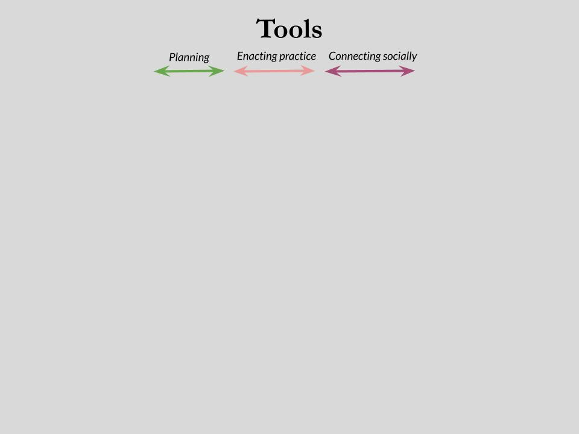
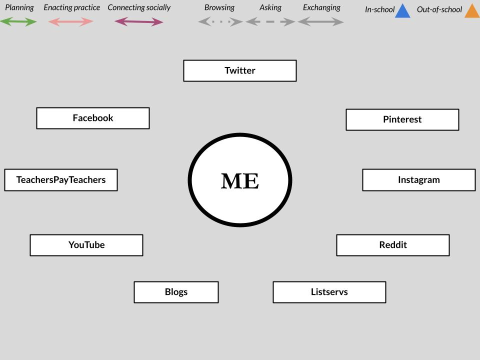
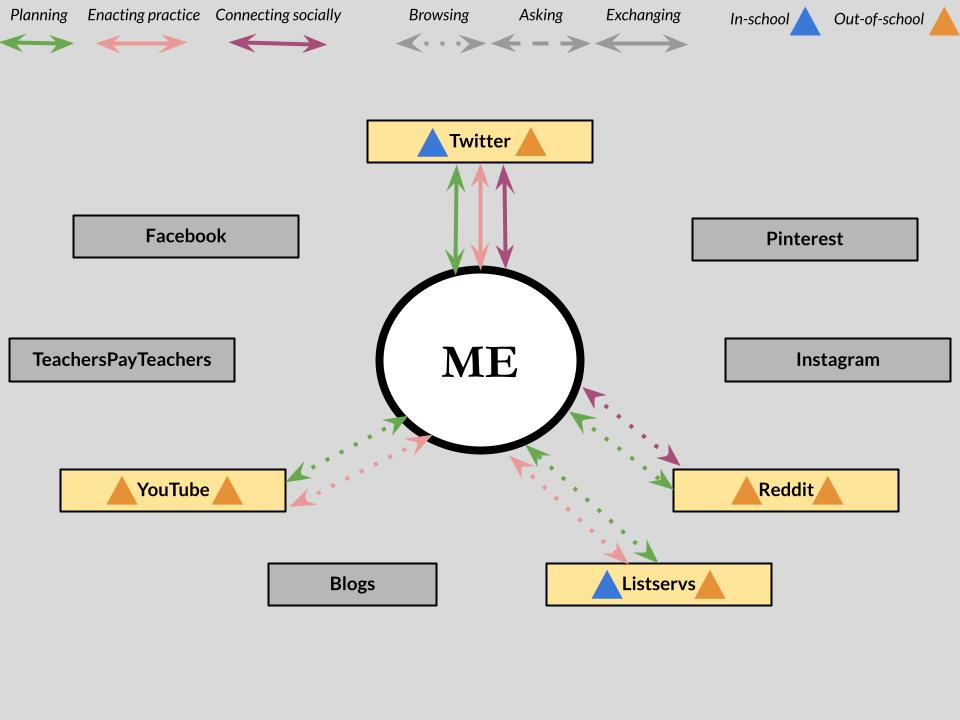

```{r setup, include=FALSE}
usethis::use_git_ignore(c("*.csv", "*.rds"))
options(htmltools.dir.version = FALSE)

library(knitr)
library(tidyverse)
library(xaringan)
library(fontawesome)
```

class: inverse, center, middle

# `r fa("far fa-images", fill = "#fff")`

**View the slides:** [bretsw.com/aect21-pln](https://bretsw.com/aect21-pln)

---

class: inverse, center, middle

# Disruptions

---

# COVID-19 Response

```{r, out.width = "720px", echo = FALSE, fig.align = "center"}
include_graphics("img/mask.jpg")
```

--

Take a moment to think back on the disruptions of the past couple of years:

--

- How did you respond? How are you responding?

--

- What help did you need to move forward?

---

# Gaps

```{r, out.width = "600px", echo = FALSE, fig.align = "center"}
include_graphics("img/puzzle-gap.jpg")
```

--

There were gaps in the pandemic response for all of us.

--

Formal, official help wasn't enough.

--

It was up to you to figure out how to fill the gaps.

---

class: inverse, center, middle

# Support Systems

---

# Build-Your-Own Support System

--

```{r, out.width = "720px", echo = FALSE, fig.align = "center"}

```

---

# Build-Your-Own Support System

```{r, out.width = "720px", echo = FALSE, fig.align = "center"}

```

---

# Build-Your-Own Support System

```{r, out.width = "720px", echo = FALSE, fig.align = "center"}
include_graphics("img/byo-model3.jpg")
```

---

# Build-Your-Own Support System

```{r, out.width = "720px", echo = FALSE, fig.align = "center"}
include_graphics("img/byo-model4.jpg")
```

---

# Build-Your-Own Support System

```{r, out.width = "720px", echo = FALSE, fig.align = "center"}

```

---

# Hidden Complexity

```{r, out.width = "720px", echo = FALSE, fig.align = "center"}

```

---

# Build-Your-Own Support System

```{r, out.width = "720px", echo = FALSE, fig.align = "center"}

```

---

# Taylor's Support System

```{r, out.width = "720", echo = FALSE, fig.align = "center"}

```

- **Gaps:** Lack of undergraduate teacher preparation

- **Tensions:** Personal-professional separation

---

# Simone's Support System

```{r, out.width = "720", echo = FALSE, fig.align = "center"}

```

- **Gaps:** Professional isolation, lack of resources

- **Tensions:** Time management

---

# Anne's Support System

```{r, out.width = "720", echo = FALSE, fig.align = "center"}
include_graphics("img/byo-model-anne.jpg")
```

- **Gaps:** Missing classroom materials, poor physical conditions

- **Tensions:** Social comparison

---

# Build-Your-Own Support System

```{r, out.width = "720px", echo = FALSE, fig.align = "center"}
include_graphics("img/byo-model-you.jpg")
```

---

class: inverse, center, middle

# Professional Learning Networks

---

# Professional Learning Networks

```{r, out.width = "560x", echo = FALSE, fig.align = "center"}
include_graphics("img/network.jpg")
```

PLNs are a particular type of **support system**: Meant to improve teaching and learning

<div class="caption">
Trust, T., Krutka, D. G., & Carpenter, J. P. (2016). “Together we are better”: Professional learning networks for teachers. Computers & Education, 102, 15-34. https://doi.org/10.1016/j.compedu.2016.06.007
<br><br>
Trust, T., & Prestridge, S. (2021). The interplay of five elements of influence on educators’ PLN actions. Teaching and Teacher Education, 97, 103195. https://doi.org/10.1016/j.tate.2020.103195
</div>

---

# Professional Learning Networks

```{r, out.width = "560px", echo = FALSE, fig.align = "center"}
include_graphics("img/network.jpg")
```

- **Tools:** knowledge, skills, teaching resources, curricular materials, and encouragement

--

- **People:** both individuals and groups

--

- **Spaces:** both online and offline

---

# PLN: BYO Support System

```{r, out.width = "720px", echo = FALSE, fig.align = "center"}
include_graphics("img/byo-model4.jpg")
```

---

class: inverse, center, middle

# Identity-Agency

---

# Identity-Agency

```{r, out.width = "600px", echo = FALSE, fig.align = "center"}
include_graphics("img/self-directed.jpg")
```

`r fa("far fa-lightbulb", fill = "#fff")` Investing in one's own self-development

<div class="caption">
Ruohotie-Lyhty, M., & Moate, J. (2016). Who and how? Preservice teachers as active agents developing professional identities. Teaching and Teacher Education, 55, 318-327. https://doi.org/10.1016/j.tate.2016.01.022
</div>

---

# Identity-Agency

```{r, out.width = "600px", echo = FALSE, fig.align = "center"}
include_graphics("img/self-directed.jpg")
```

`r fa("far fa-lightbulb", fill = "#fff")` Being an active agent

<div class="caption">
Tao, J., & Gao, X. (2017). Teacher agency and identity commitment in curricular reform. Teaching and Teacher Education, 63, 346-355. https://doi.org/10.1016/j.tate.2017.01.010
</div>

---

# Identity-Agency

```{r, out.width = "600px", echo = FALSE, fig.align = "center"}
include_graphics("img/self-directed.jpg")
```

`r fa("far fa-lightbulb", fill = "#fff")` Taking purposeful actions

<div class="caption">
Pearce, J., & Morrison, C. (2011). Teacher identity and early career resilience: Exploring the links. Australian Journal of Teacher Education, 36, 47–59. https://doi.org/10.14221/ajte.2011v36n1.4
</div>

---

# Identity-Agency

```{r, out.width = "600px", echo = FALSE, fig.align = "center"}
include_graphics("img/self-directed.jpg")
```

`r fa("far fa-lightbulb", fill = "#fff")` Identifying challenges, forming strategies, and taking action

<div class="caption">
Bandura, A. (2001). Social cognitive theory: An agentic perspective. Annual Review of Psychology, 52(1), 1-26. https://doi.org/10.1146/annurev.psych.52.1.1
</div>

---

class: inverse, center, middle

# The Study

---

# Purpose

```{r, out.width = "600px", echo = FALSE, fig.align = "center"}
include_graphics("img/teacher.jpg")
```

Explore **build-your-own support systems** 

--

that early career teachers construct 

--

during **induction** - the disrupted transition period from preparation to practice

---

# Participants

```{r, out.width = "280px", echo = FALSE, fig.align = "center"}
include_graphics("img/teaching.jpg")
```

--

I wanted to understand what early career teachers are doing,

--

so I talked to them (semi-structured interviews):

--

- MSU College of Education Master's degree students (*n* = 9)

--

- 0-3 years experience in teaching

--

- Teaching in U.S. (geographically dispersed)

--

- Distinct backgrounds and experiences: classroom teachers, specialists, itinerants, starting mid-year

---

class: inverse, center, middle

# Results

---

class: inverse, center, middle

# `r fa("fas fa-quote-left", fill = "#fff")` <br> Reasons for Agency

### "I have one teacher who just wants to use curriculum from 30 years ago. And I'm just like, ‘I can't do it.’ There are just completely irrelevant things." <br> ~ Hallie

---

class: inverse, center, middle

# `r fa("fas fa-quote-left", fill = "#fff")` <br> Reasons for Agency

### "**I feel like I filled a lot of gaps.** If I couldn't find something, I'd go to social media to find it." <br> ~ Julie

---

class: inverse, center, middle

# `r fa("fas fa-quote-left", fill = "#fff")` <br> Reasons for Agency

### "I wish there was a way to use social media like, ‘Here's a problem I'm dealing with; can people help me with this problem?’" <br> ~ Julie

---

class: inverse, center, middle

# `r fa("fas fa-quote-left", fill = "#fff")` <br> Reasons Why Not

### "If I don't have time for myself, then I'm doing [my students] a disservice. I have to have that shut-off button." <br> ~ Mike

---

class: inverse, center, middle

# `r fa("fas fa-quote-left", fill = "#fff")` <br> Reasons Why Not

### "Sometimes I feel like, it makes me feel like a crappy teacher, because I'm seeing them do all these things." <br> ~ Anne

---

class: inverse, center, middle

# Discussion

---

# Agentic Choices

```{r, out.width = "600", echo = FALSE, fig.align = "center"}
include_graphics("img/self-directed.jpg")
```

--

- Teachers were consistent in making agentic choices for their professional development 

--

- but varied in the specifics of their agentic actions

---

# Purposeful Agentic Choices

```{r, out.width = "600px", echo = FALSE, fig.align = "center"}
include_graphics("img/self-directed.jpg")
```

- Early career teachers exercised **agency** in filling gaps and navigating tensions

--

- **Purposeful** sense of having a job to do

---

# Purposeful Agentic Choices

```{r, out.width = "600px", echo = FALSE, fig.align = "center"}
include_graphics("img/self-directed.jpg")
```

- Determination to find the tools, people, and spaces necessary to do that job well

--

- **Purposeful** plan for each social media platform

---

# Purposeful Agentic Choices

```{r, out.width = "600px", echo = FALSE, fig.align = "center"}
include_graphics("img/self-directed.jpg")
```

- As well as intentionality to sometime choose *not* to pursue (boundaries)

--

- **Purposeful** to maintain personal-professional separation, even more important than potential benefits

---

class: inverse, center, middle

# Implications

---

# Implications for Early Career Ts

```{r, out.width = "480px", echo = FALSE, fig.align = "center"}
include_graphics("img/puzzle-gap.jpg")
```

### Passion alone is not enough

--

- Build-your-own support systems are necessary

--

- Today there are more available tools, people, and spaces to fill the **gaps**

--

- Many early career teachers likely navigate increased **tensions** related to *context collapse* and *social comparison*

---

# Implications for Ed Leaders

```{r, out.width = "480px", echo = FALSE, fig.align = "center"}
include_graphics("img/puzzle-gap.jpg")
```

### Agency is finite

--

- Meet early career teachers where they are as they try to fill **gaps**:

--

  - Expand notions of what "counts" for professional development to include social media: alleviates some **tensions** around time

--

  - Set up protected spaces for early career teachers and train them to use: alleviates some **tensions** around social comparison

---

# Implications for Researchers

```{r, out.width = "480px", echo = FALSE, fig.align = "center"}
include_graphics("img/puzzle-gap.jpg")
```

### PLNs don't magically appear

--

- Support systems are built with purpose and intention

--

- Researchers must foreground phenomena like identity-agency to really understand PLNs

---

class: inverse, center, middle

# Conclusion

---

# Conclusion

```{r, out.width = "600px", echo = FALSE, fig.align = "center"}
include_graphics("img/support-system-wide.jpg")
```

- Identity-agency helps us better understand responses to **induction** disruptions (and other disruptions)

--

- and move a bit closer to **sustaining**, not just retaining, early career teachers (and other professionals)

---

class: inverse, center, middle

# Questions?

```{r, out.width = "480px", echo = FALSE, fig.align = "center"}
include_graphics("img/question.jpg")
```

`r fa("envelope", fill = "white")` [bret.staudtwillet@fsu.edu](mailto:bret.staudtwillet@fsu.edu) | `r fa("twitter", fill = "white")` [@bretsw](https://twitter.com/bretsw) | `r fa("globe", fill = "white")` [bretsw.com](http://bretsw.com)